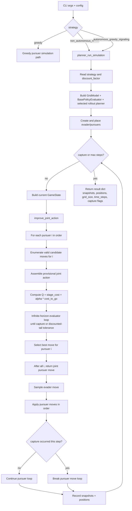

# Can Learned Signaling Approximate Multi-Agent Rollout in 3D fully observable rollout

# Todo
Fix creating gif leads to out of memory
Make the planner work with multiple agents 
Integrate the planner based simulation with the visualization code

# Project Setup

Install UV
and do ``` uv sync ```

then ``` uv run python main.py --config config.yaml ```

Choose the controller with one unified strategy flag:

```bash
uv run python main.py --config config.yaml --strategy greedy
uv run python main.py --config config.yaml --strategy non_autonomous_rollout
uv run python main.py --config config.yaml --strategy autonomous_greedy_signaling
```

Add multiple evaders by including multiple entries under `evaders:` in the config. Greedy and rollout strategies run until all active evaders are captured or `simulation.time_steps` is reached.

## Planner Behavior Notes

### Are all pursuers using infinite-horizon rollout?

Yes. Planner scoring uses an infinite-horizon discounted value rollout approximation, with an important nuance.

- The base evaluator keeps simulating until capture or until the remaining discounted tail is negligible.
- Every pursuer candidate action is scored through that same evaluator.
- The default planner is still **nonautonomous one-agent-at-a-time rollout improvement**, not full joint optimization in one solve.

So each pursuer participates in infinite-horizon scoring, but decisions are improved sequentially (`P0`, then `P1`, then `P2`, ...), which can create order bias.

### Why `P0` can appear to dominate captures

- Pursuer improvements are done in index order.
- Earlier chosen moves are fixed when later pursuers are optimized.
- During execution, if a pursuer captures the evader, the per-step move loop breaks immediately.

This can make `P0` seem strongest even when later pursuers are also being evaluated.

## Strategy Flowchart



# Dir structure

Inventory Refreshed: 2026-04-12T15:57:49-0700
Git Baseline: 33b3741 (2026-04-12T03:52:04-07:00)

This project studies 3D pursuit-evasion rollouts on configurable grids, focusing on evader movement and slice-based visualization.
It provides a CLI-driven research workflow to simulate runs, export per-timestep snapshots, and generate GIF artifacts for analysis.

## Directory Structure

```text
3d-pursuit-rollout/
├── .github/
│   └── copilot-instructions.md
├── .gitignore
├── .python-version
├── 3d-pursuit.ipynb
├── cli_slice_smoke.png
├── config.yaml
├── main.py
├── pyproject.toml
├── README.md
├── uv.lock
└── src/
	├── __init__.py
	├── agents/
	│   ├── __init__.py
	│   ├── base.py
	│   ├── evader.py
	│   ├── factory.py
	│   └── pursuer.py
	├── data_types/
	│   ├── __init__.py
	│   └── postion.py
	├── grid.py
	├── simulation/
	│   ├── __init__.py
	│   └── simulation.py
	├── utils/
	│   ├── __init__.py
	│   └── constants.py
	└── visualization/
		├── __init__.py
		└── slices.py
```

## File Summaries (3 words each)

| File | Summary |
| --- | --- |
| 3d-pursuit.ipynb | Notebook simulation experiments |
| cli_slice_smoke.png | Sample slice render |
| config.yaml | Simulation default configuration |
| .github/copilot-instructions.md | Repository coding guidelines |
| .gitignore | Ignore generated artifacts |
| main.py | Entrypoint run orchestration |
| pyproject.toml | Project dependency metadata |
| .python-version | Pinned python version |
| README.md | Project overview document |
| src/agents/base.py | Agent base abstraction |
| src/agents/evader.py | Evader policy implementations |
| src/agents/factory.py | Agent factory mapping |
| src/agents/__init__.py | Agents package marker |
| src/agents/pursuer.py | Pursuer policy placeholder |
| src/data_types/__init__.py | Data types package |
| src/data_types/postion.py | Position pydantic model |
| src/grid.py | Three dimensional grid |
| src/__init__.py | Source package marker |
| src/simulation/__init__.py | Simulation package marker |
| src/simulation/simulation.py | Simulation rollout loop |
| src/utils/constants.py | Constants placeholder module |
| src/utils/__init__.py | Utilities package marker |
| src/visualization/__init__.py | Visualization package exports |
| src/visualization/slices.py | Slice plotting utilities |
| uv.lock | Resolved dependency lockfile |
