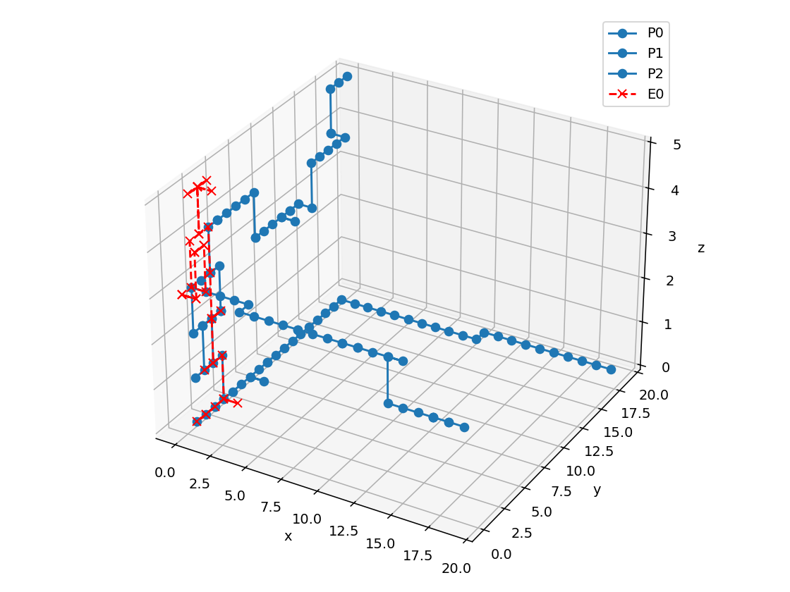
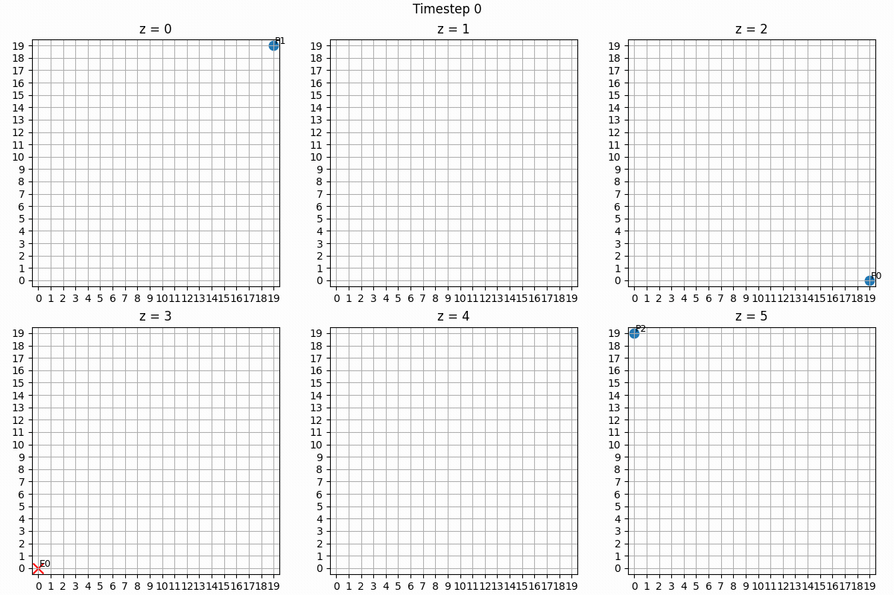
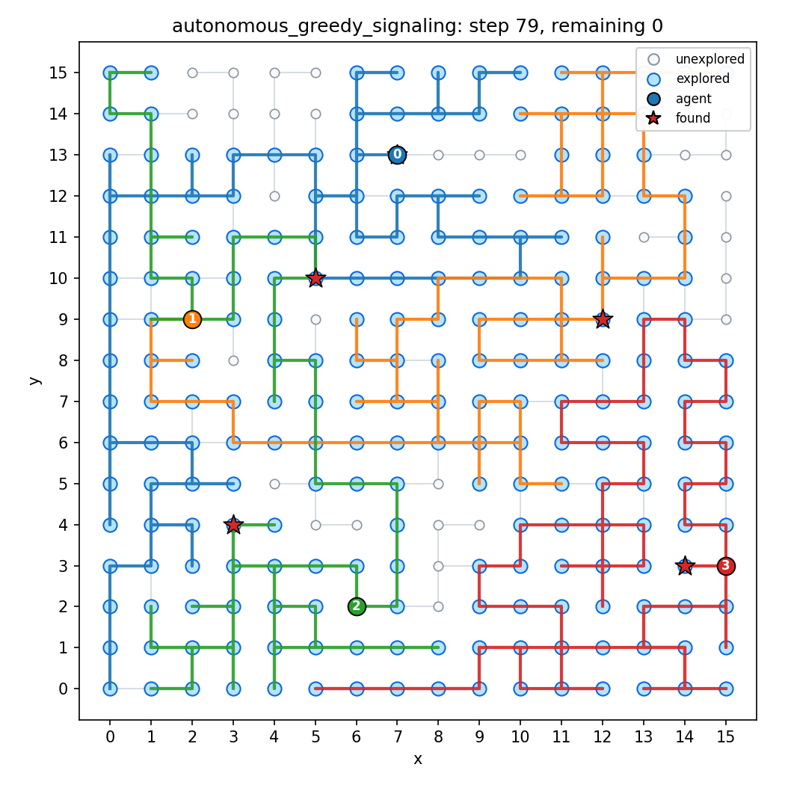
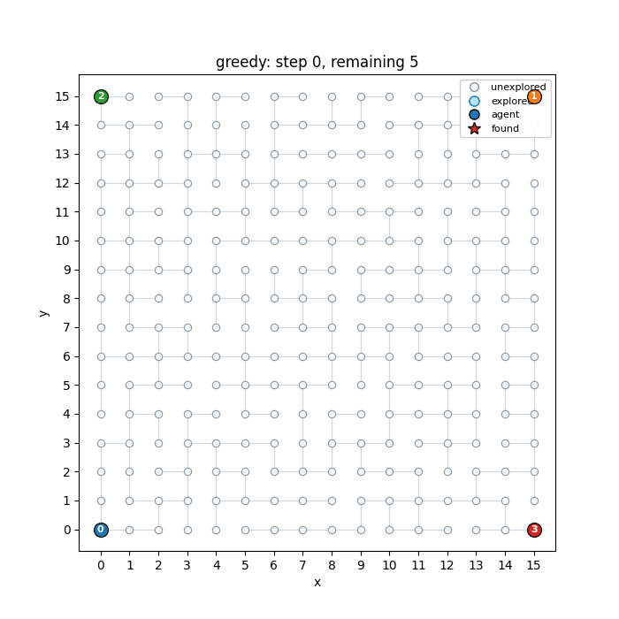
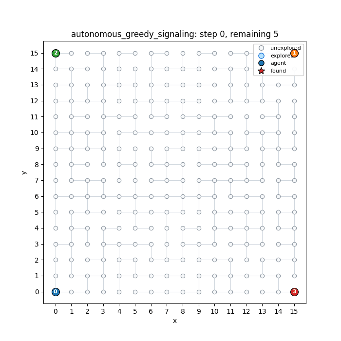

# Multi-Agent Rollout for Grid Pursuit and Sparse-Graph Rescue Search

Muhammad Ibraheem  
CSE 691: Topics in Reinforcement Learning  
Final presentation draft

Source report: `cse_691_final_report (2).pdf`

---

# Core Question

Can rollout-based coordination improve multi-agent search, and can signaling approximate coordinated rollout decisions with less online coordination?

Two testbeds:

- Open 3D grid pursuit with mobile random-walk target.
- Sparse-graph rescue search with corridors, chokepoints, explored-node history, and multiple lost individuals.

---

# Motivation

Greedy search works well when the environment is open and local progress is enough.

It can break down when:

- agents duplicate effort,
- graph structure creates chokepoints,
- explored regions should be avoided,
- multiple targets or lost individuals require task allocation.

Rollout evaluates downstream consequences of candidate actions using a base policy.

---

# Algorithm Ladder

1. **Greedy baseline**
   - Grid: move toward target by Manhattan distance.
   - Rescue graph: move toward closest unexplored node.

2. **Agent-by-agent rollout**
   - Improve one agent action at a time over the greedy base policy.

3. **Autonomous rollout + greedy signaling**
   - Each agent assumes the others will take greedy actions.

4. **Autonomous rollout + learned signaling**
   - Each agent predicts rollout-like actions for the others from offline data.

---

# Agent-by-Agent Rollout

Start with a base greedy joint action:

```text
u <- mu(x)
```

Then sequentially improve each component:

```text
u_i <- argmin_a Q_rollout(x, u_1, ..., u_{i-1}, a, mu_{i+1}(x), ..., mu_m(x))
```

Key property:

- Later agents condition on earlier agents' improved decisions.
- This preserves coordination structure without enumerating the full joint action space.

---

# Autonomous Signaling

Autonomous rollout removes the sequential dependency by giving each agent a prediction of what the others will do.

Greedy signaling:

```text
nu_G(x) = mu_greedy(x)
```

Learned signaling:

```text
nu_L(x) ~= mu_agent-by-agent-rollout(x)
```

The learned model is trained offline from expert rollout decisions.

---

# Testbed 1: Open 3D Grid Pursuit

State:

```text
x_k = (p^1_k, ..., p^m_k, q_k)
```

Actions:

```text
stay, +/-x, +/-y, +/-z
```

Objective:

```text
minimize discounted time-to-capture
```

Target:

- fully observable,
- random-walk motion.

---

# Grid Pursuit Visual



Run artifact:

- `outputs/04_25_2026_22_12_59/trajectory_3d.png`
- `outputs/04_25_2026_22_12_59/simulation.gif`

---

# Grid Pursuit Animation



---

# Grid Pursuit Results

Open 3D grid pursuit over 100 runs:

| Method | Capture Rate | Avg. Capture Time | Avg. Cost | Runtime / Step |
| --- | ---: | ---: | ---: | ---: |
| Greedy | 100.0% | 18.85 | 30.44 | 0.0004s |
| Agent-by-agent rollout | 100.0% | 23.19 | 38.95 | 0.1154s |
| Autonomous rollout + greedy signaling | 100.0% | 22.93 | 38.54 | 0.1029s |
| Autonomous rollout + learned signaling | 100.0% | 23.98 | 40.16 | 0.1203s |

Takeaway:

- Greedy is strongest in the open-grid random-walk setting.

---

# Interpretation: Why Greedy Wins in the Open Grid

The open-grid pursuit task is not coordination-limited enough.

Reasons:

- target is fully observable,
- random-walk dynamics are simple,
- direct Manhattan pursuit is already strong,
- rollout adds compute but does not create better structure to exploit.

Main lesson:

> Rollout is not automatically better than a strong greedy base policy.

---

# Testbed 2: Sparse-Graph Rescue Search

Graph:

```text
G = (V, E)
```

Each node is a location. Each edge is a feasible movement.

State includes:

- rescue-agent locations,
- found-individual set,
- globally explored-node set,
- hidden or known lost-individual locations depending on formulation.

Objective:

```text
minimize cumulative cost from unfound individuals
```

---

# Sparse Rescue Graph Visual



Visual encoding:

- gray nodes: unexplored,
- blue nodes: explored,
- colored markers: rescue agents,
- edges: traversable graph structure.

---

# Rescue Animation: Greedy



---

# Rescue Animation: Rollout With Greedy Signaling



---

# Rescue Rollout Cost

Reported objective:

```text
J = sum_t gamma^t * (# unfound individuals at time t)
```

Rollout scoring also uses an explored-node penalty:

```text
R(s_t, u_t) = lambda * sum_i 1[u^i_t in H_t]
```

Rollout score:

```text
Q_rollout(s_t, u_t) =
  (# unfound individuals)
  + R(s_t, u_t)
  + gamma * V_base(s_{t+1})
```

The revisit penalty shapes planning only; reported metrics use the original search objective.

---

# Sparse-Graph Rescue Results

Sparse-graph rescue search over 50 sampled runs:

| Method | Find Rate | Avg. Time to Find All | Avg. Search Cost | Avg. Discounted Cost | Runtime / Step |
| --- | ---: | ---: | ---: | ---: | ---: |
| Greedy closest-unexplored | 100.0% | 91.94 | 260.48 | 187.47 | 0.0092s |
| Agent-by-agent rollout | 100.0% | 74.00 | 200.42 | 154.58 | 0.1115s |
| Autonomous rollout + greedy signaling | 100.0% | 74.58 | 201.44 | 154.51 | 0.1056s |

Takeaway:

- Rollout helps when graph structure creates coordination pressure.

---

# Rescue Improvement Over Greedy

From the report:

- Agent-by-agent rollout reduces average time-to-find from **91.94** to **74.00**.
- Approximate reduction: **19.5%**.

Search cost:

- Greedy: **260.48**
- Agent-by-agent rollout: **200.42**
- Approximate reduction: **23.1%**.

Autonomous greedy signaling is close to agent-by-agent rollout on cost.

---

# Learned Signaling

Training data:

```text
D = {(features(s, i), expert_action_i)}
```

Expert:

```text
expert_action = agent-by-agent rollout action
```

At runtime:

```text
base_action[j] = learned_signal.predict(s, j)
```

Then each agent optimizes its own candidate while holding learned predictions for the others fixed.

---

# Learned Signaling Features

Grid pursuit:

- relative pursuer-target geometry,
- Manhattan-distance exponential kernel,
- weighted kNN action vote.

Rescue graph:

- focus-agent-first geometry,
- explored-node mask,
- valid-action mask,
- known-target mask only if targets are known,
- no hidden lost-person locations in unknown-target mode.

---

# Current Implementation Status

Completed:

- 3D grid pursuit simulator.
- Greedy, agent-by-agent rollout, autonomous greedy signaling.
- Kernel learned signaling for grid pursuit.
- Sparse-graph rescue testbed.
- Rescue visualizations and experiment-table tooling.
- Rescue learned-signaling implementation added after the submitted report:
  - kernel kNN backend,
  - pure NumPy MLP backend,
  - data collection and training scripts.

---

# Main Conclusion

The value of rollout depends on environment structure.

Open grid pursuit:

- greedy policy is already strong,
- rollout adds computational cost without improving outcome.

Sparse graph rescue:

- graph constraints and explored-node history create coordination structure,
- rollout improves time-to-find and cumulative search cost.

---

# Limitations

- Current environments are still simplified.
- Rescue search uses known graph structure.
- Hidden lost individuals are modeled by unknown locations, but not full belief-state POMDP planning.
- Revisit penalty helps shape rollout; ablation with `lambda = 0` should be run.
- Runtime cost of rollout is much higher than greedy.

---

# Next Steps

Near-term:

- Run graph learned-signaling experiments and add it to the rescue results table.
- Compare `kernel_knn` vs `mlp` learned signaling.
- Ablate revisit penalty.
- Use paired seeds and fixed disturbance streams for cleaner algorithm comparisons.

Longer-term:

- Partial observability and belief updates.
- 3D unknown-environment exploration.
- Frontier or information-gain search objectives.

---

# Backup: Key Commands

Collect rescue learned-signaling data:

```bash
uv run python scripts/collect_rescue_signaling_data.py \
  --config rescue_config.yaml \
  --output models/rescue_signaling_dataset.npz \
  --episodes 50 \
  --seed 0
```

Train kernel model:

```bash
uv run python scripts/train_rescue_signaling_model.py \
  --config rescue_config.yaml \
  --dataset models/rescue_signaling_dataset.npz \
  --output models/rescue_signaling_kernel.npz \
  --model-type kernel_knn
```

---

# Backup: Experiment Table Command

```bash
uv run python scripts/run_rescue_experiment_table.py \
  --config rescue_config.yaml \
  --runs 50 \
  --base-seed 0 \
  --strategies greedy non_autonomous_rollout autonomous_greedy_signaling autonomous_learned_signaling \
  --signaling-model models/rescue_signaling_kernel.npz
```

Outputs:

```text
outputs/rescue_experiments/<timestamp>/
```

