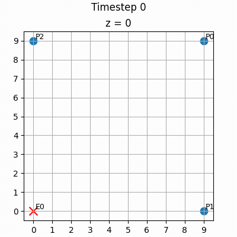
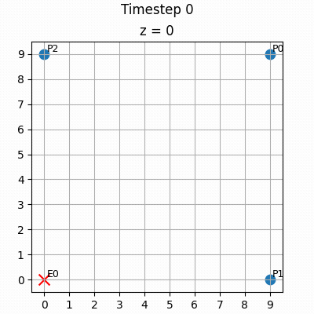
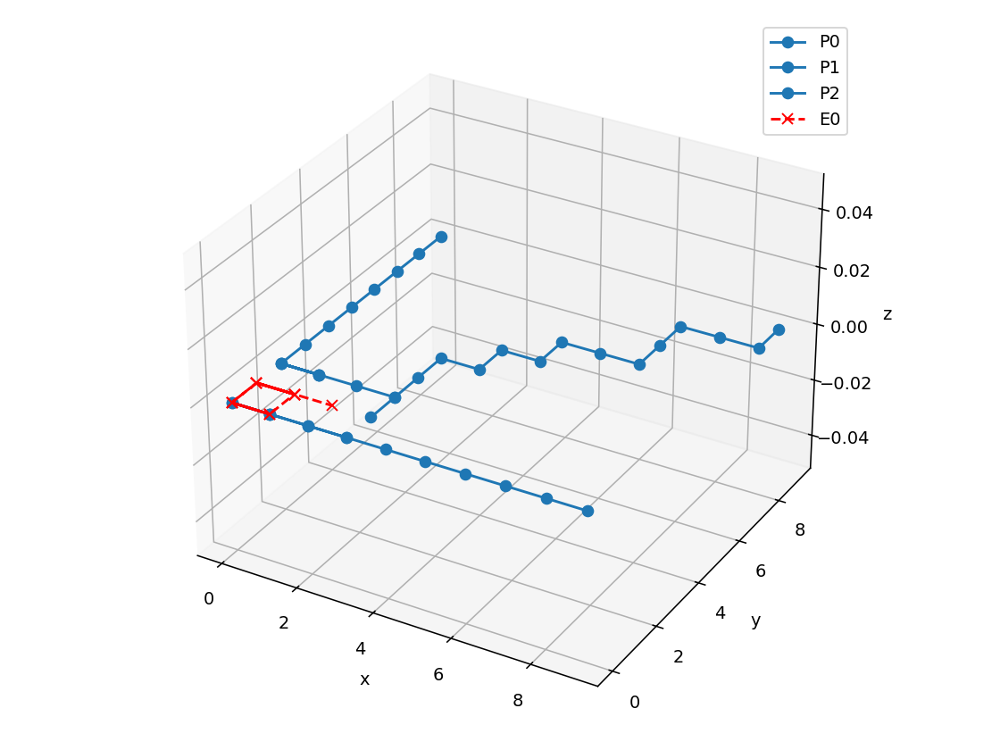
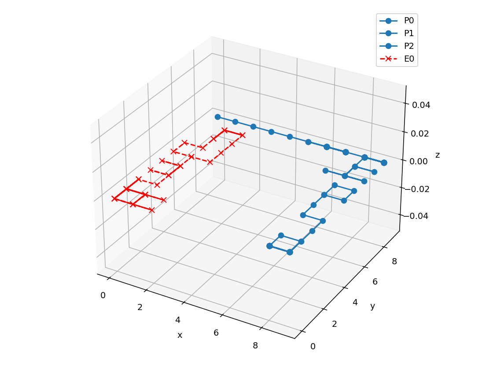
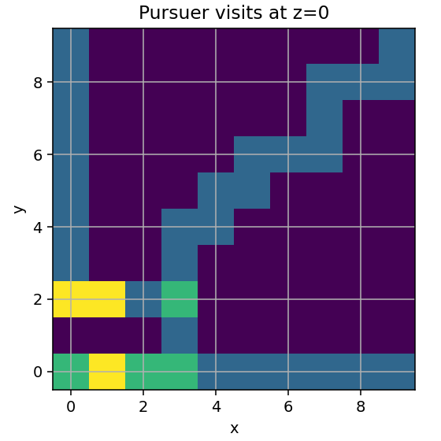
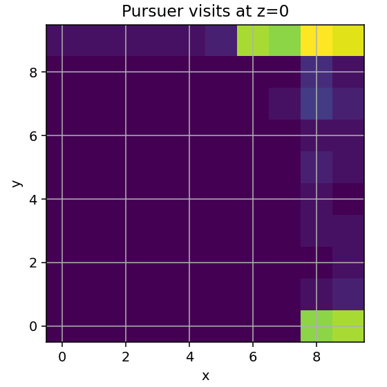

# CSE 691 Project Progress Update

Autonomous Multi-Agent Rollout with Learned Signaling in a 3D Discrete Pursuit Problem

Based on: cse691_project_proposal.pdf

Muhammad Ibraheem

April 14, 2026

---

# 1) Proposal Summary (What Was Promised)

Primary objective:

- Study cooperative pursuit in a fully observable 3D grid first.
- Test whether signaling can approximate centralized multi-agent rollout.

Optional objective:

- Extend to partial observability (belief-state/POMDP) if time permits.

Core question:

- Can learned signaling preserve performance while reducing online coordination and compute?

---

# 2) Mathematical Formulation in the Proposal

State:

$$
x_k = (p_k^1, \dots, p_k^m, x_k^e), \quad p_k^i, x_k^e \in \mathcal{G}
$$

Joint control:

$$
u_k = (u_k^1, \dots, u_k^m), \quad u_k^i \in \{\text{stay}, \pm x, \pm y, \pm z\}
$$

Transition and discounted objective:

$$
x_{k+1}=f(x_k,u_k,w_k), \quad
J^*(x)=\min_u \mathbb{E}[g(x,u)+\alpha J^*(f(x,u,w))]
$$

Stage cost in proposal:

- 0 if capture occurs.
- 1 otherwise.

---

# 3) Planned Algorithm Ladder (From Proposal)

1. Base policy: decentralized greedy pursuit.
2. Nonautonomous multi-agent rollout (one-agent-at-a-time improvement over base policy).
3. Autonomous rollout with signaling policy.
4. Learned signaling policy trained offline to imitate centralized rollout recommendations.

---

# 4) Current Implementation Snapshot

Implemented today:

- Baseline simulation pipeline for evader and multiple pursuers.
- Nonautonomous rollout planner path integrated into the same runtime.
- Unified outputs so both modes drive the same visualizations.
- Reproducible CLI workflow via uv and seed control.

Main code locations:

- main.py
- src/simulation/simulation.py
- src/simulation/planner.py
- src/planner/nonautonomous_rollout.py
- src/visualization/slices.py

---

# 5) Progress Against Proposal Commitments

Completed:

- Fully observable 3D pursuit simulation environment.
- Greedy baseline and nonautonomous rollout path.
- Metrics-ready outputs and visualization tooling.

Partially complete:

- Planner currently supports one evader and multiple pursuers.
- Planner quality is below baseline and needs objective/model improvements.

Not started yet:

- Autonomous rollout with signaling policy.
- Learned signaling model training.
- POMDP extension with belief-state updates.

---

# 6) Milestone: Visualization and Experiment Tooling

Delivered capabilities:

- Slice-based rendering from positions history.
- Visit heatmaps.
- 3D trajectory plotting.
- GIF export pipeline.

CLI controls:

- --save-gif
- --plot-heatmap
- --plot-3d-trajectory
- --plot-all

---

# 7) Milestone: Memory-Safe GIF Export

Problem found:

- In-memory frame accumulation could trigger out-of-memory failures.

Fix implemented:

- Streaming GIF generation through ffmpeg pipe.
- Frames rendered and written incrementally.

Impact:

- Stable GIF generation for long rollouts.

---

# 8) Milestone: Planner and Visualization Integration

What changed:

- Planner mode now returns the same schema as baseline mode:
  - snapshots
  - positions
  - grid_size
  - time_steps
  - capture_occurred
  - remaining_evaders

Outcome:

- Existing plotting and export code works unchanged in planner mode.

---

# 9) Quantitative Status (50 Seeds, Current Config)

Experimental setup:

- Config: 10x10x1 grid, 1 random evader, 3 greedy pursuers.
- Compared baseline mode vs planner mode over seeds 0-49.

Results:

| Mode | Capture Rate | Avg Steps | Median Steps | Avg Remaining Evaders |
|---|---:|---:|---:|---:|
| Baseline (Greedy pursuers) | 1.00 | 12.54 | 13.0 | 0.00 |
| Planner mode | 0.36 | 46.10 | 50.0 | 0.64 |

Takeaway:

- Planner is integrated, but currently underperforms baseline.

---

# 10) Why Planner Is Behind Baseline Right Now

Main technical reasons observed:

- Sparse stage cost (capture or not) gives weak gradients far from capture.
- Short rollout horizon (8) limits strategic advantage.
- Tie-heavy scoring causes oscillatory movement patterns.
- Planner internal transition is an approximation of runtime dynamics.
- Single-sample stochastic evader modeling increases value noise.

Interpretation:

- The infrastructure is working; the planner objective and modeling assumptions need refinement.

---

# 11) Visual Evidence (Baseline vs Planner)

Baseline run directory:

- outputs/04_14_2026_19_55_14

Planner run directory:

- outputs/04_14_2026_19_55_18

Baseline GIF:

Planner GIF:

Baseline trajectory:

Planner trajectory:

Baseline visit heatmap:

Planner visit heatmap:

---

# 12) What This Means for the Proposal

The project is on track structurally:

- Environment, baseline, planner skeleton, and experiments are in place.

The core proposal claim is not validated yet:

- Learned signaling has not been implemented yet.
- Current planner underperformance indicates more algorithm work is needed before signaling comparisons.

This is normal for current phase:

- Infrastructure-first, then policy quality, then signaling approximation.

---

# 13) Next Steps to Reach Proposal Goals

Immediate next technical steps:

1. Improve planner objective with dense shaping (distance-to-evader + capture bonus).
2. Increase and ablate rollout horizon/discount.
3. Stabilize tie-breaking and use multi-sample evader expectation.
4. Add autonomous signaling policy scaffold.
5. Train learned signaling policy to imitate centralized recommendations.

Optional extension (if time permits):

- Belief-state POMDP version with shared evader belief updates.

---

# 14) Live Demo Plan (Presentation)

Commands:

1. Baseline outputs:
  uv run python main.py --config config.yaml --plot-all --save-gif

2. Planner outputs:
  uv run python main.py --config config.yaml --planner --plot-all --save-gif

3. Compare artifacts and summarize metric gap.

What the audience should see:

- Working end-to-end pipeline.
- Clear benchmark gap.
- Concrete roadmap from current status to proposal target.

---

# 15) Discussion Points for Feedback

- Best shaping objective for pursuit-evasion rollout in this setting.
- Preferred evaluation protocol for fair comparison across algorithm stages.
- Priority order: planner quality first vs early signaling prototype.
